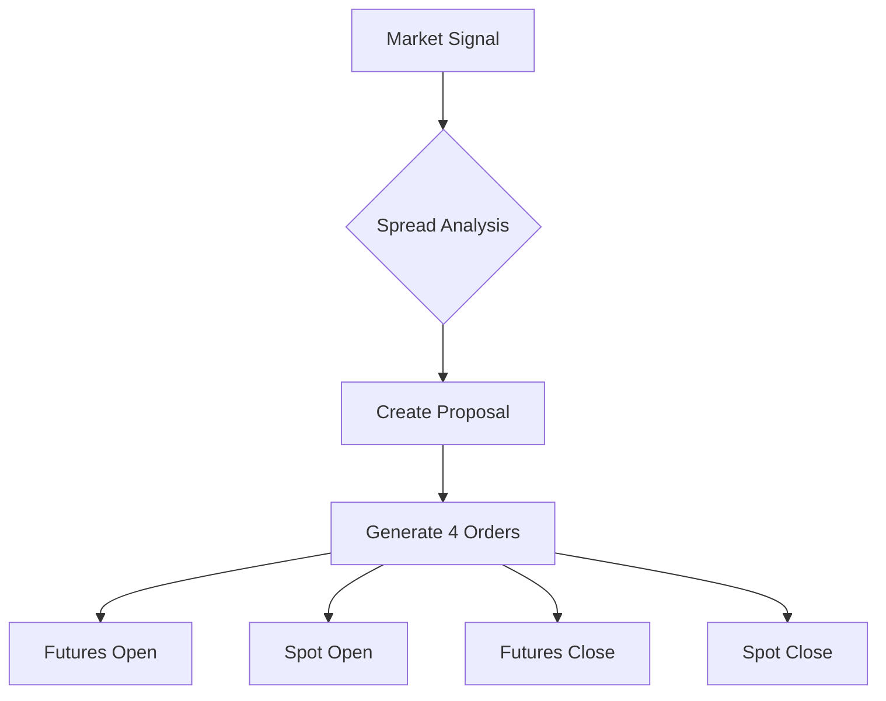

# Introduction and Implementation of Futures and Spot Arbitrage Strategies  

## Understanding Futures and Spot Markets  

### What Are Spot Markets?  
**Spot markets** refer to the immediate exchange of physical assets or cryptocurrencies for cash. These transactions settle "on the spot" – hence the name. Common examples include:  
- **Commodities**: Soybeans, corn  
- **Cryptocurrencies**: Bitcoin (BTC), Ethereum (ETH)  

**Spot trading** involves direct ownership transfer:  
- Buying 2 pounds of soybeans for ¥10  
- Purchasing 1 BTC for $50,000  
- Bartering 2 pounds of soybeans for 3 pounds of corn  

### What Are Futures Markets?  
**Futures contracts** are standardized agreements to buy/sell assets at predetermined prices and dates. Key characteristics:  
1. **Time-based**: Contracts specify delivery periods (e.g., Dalian Commodity Exchange's soybean contracts)  
2. **Leverage-enabled**: Platforms like OKX offer up to 125x leverage for crypto futures  

**Example Futures Contracts**:  
| Exchange | Contract | Underlying Asset | Delivery Date | Trading Unit | Margin Requirement |  
|---------|----------|------------------|---------------|--------------|--------------------|  
| Dalian Commodity Exchange | b2111 | Soybean No.2 | 13th trading day of Nov 2021 | 10 tons/contract | 5% of contract value |  
| OKX | BTCUSDT Quarterly 1231 | Bitcoin | Dec 31, 2021 | 0.01 BTC/contract | Up to 125x leverage |  

👉 [Explore crypto futures on OKX](https://bit.ly/okx-bonus)  

## Core Mechanics of Futures Trading  

### Trading Directions and Margin System  
1. **Bullish Positions**: Going long when anticipating price increases  
2. **Bearish Positions**: Shorting assets expected to decline  

**Margin Example**:  
- With $50,000 BTC price and 100x leverage, $500 margin controls 1 BTC  
- 1% price movement creates $500 profit/loss (100% ROI swing)  

### Futures vs. Perpetual Contracts  
| Feature | Delivery Contracts | Perpetual Contracts |  
|---------|--------------------|---------------------|  
| Expiry Date | Fixed (e.g., Dec 31) | None |  
| Price Convergence | Natural toward spot at expiry | Achieved via funding rates |  
| Funding Mechanism | N/A | Longs pay shorts (positive rate) or vice versa |  

## Arbitrage Strategy Fundamentals  

### The Arbitrage Opportunity  
When futures trade at significant premiums (e.g., 9% above spot price), traders can:  
1. **Buy spot assets** while **shorting equivalent futures**  
2. **Profit mechanism**:  
   - Initial spread (S1) - Final spread (S2) - Transaction fees (F)  
   - Example: 9% premium narrowing to 3% generates 6% net profit (minus fees)  

👉 [Analyze live crypto spreads on OKX](https://bit.ly/okx-bonus)  

### Quantitative Implementation Framework  

#### Essential Components:  
1. **Data Pipeline**: API integration with exchanges for:  
   - Real-time order book depth  
   - Balance monitoring  
2. **Algorithm Logic**:  
   - Automated proposal triggers for:  
     - Opening/rebalancing positions  
     - Order state management  

#### Order Workflow Architecture:  


## Advanced Strategy Considerations  

### Critical Implementation Challenges:  
1. **Order Execution**:  
   - Limit vs. market orders in volatile markets  
   - Handling partial fills and network timeouts  
2. **Risk Management**:  
   - Calculating optimal leverage ratios  
   - Monitoring funding rate impacts (e.g., negative rates in BTC perpetuals)  
3. **Technical Infrastructure**:  
   - API rate limit management  
   - Error handling for server-side 500 errors  

### AMM Market Specifics  
Automated Market Makers (AMMs) introduce unique considerations:  
- Dynamic fee structures based on liquidity pools  
- Slippage management in decentralized exchanges  

## Strategy Validation and Testing  

### Backtesting Methodology  
1. **Historical Data**:  
   - 3-year BTC/USDT price data  
   - Funding rate history analysis  
2. **Performance Metrics**:  
   - Sharpe ratio calculation  
   - Maximum drawdown analysis  

### Live Implementation Checklist  
- [ ] Exchange API key integration  
- [ ] Position size calculator  
- [ ] Real-time P&L dashboard  
- [ ] Emergency liquidation protocol  

👉 [Start backtesting on OKX](https://bit.ly/okx-bonus)  

## Frequently Asked Questions  

**Q1: What's the minimum capital required for futures-spot arbitrage?**  
A: While technically possible with $5,000, professional operations typically maintain $50,000+ to manage margin requirements and execution risks effectively.  

**Q2: How often do profitable arbitrage opportunities occur?**  
A: In crypto markets, 7-15 opportunities exist daily with >5% spreads. Traditional commodities show 2-3 weekly opportunities.  

**Q3: What are the biggest risks in arbitrage trading?**  
A: Top risks include:  
1. Sudden exchange liquidity drops  
2. Regulatory changes in commodity markets  
3. Crypto exchange hacking events  

**Q4: Can this strategy work for forex markets?**  
A: While theoretically applicable to FX forwards, implementation differs due to:  
- Tighter spreads (<0.5%)  
- Higher institutional participation  
- Different margin requirements  

**Q5: How to handle cross-exchange arbitrage?**  
A: Requires:  
- Simultaneous position opening on multiple platforms  
- Real-time price monitoring systems  
- Fast withdrawal channels  

## Implementation Roadmap  

### Step-by-Step Execution Guide  
1. **Platform Selection**:  
   - Open OKX institutional account for API access  
   - Choose stablecoin-margined contracts for lower volatility exposure  
2. **Data Infrastructure**:  
   - Deploy WebSocket connections for order book depth  
   - Implement Redis caching for price data  
3. **Algorithm Development**:  
   - Build spread calculation engine  
   - Create order execution state machine  
4. **Risk Controls**:  
   - Implement circuit breakers for >15% volatility  
   - Develop position rebalancing logic  

### Performance Optimization Techniques  
- **Machine Learning**: Train models to predict funding rate reversals  
- **Latency Reduction**: Use colocated servers near exchange data centers  
- **Execution Algorithms**: Develop smart order routing (SOR) systems  

## Market Analysis and Case Studies  

### Historical Spread Patterns  
| Asset | Avg. Monthly Spread | Max Observed Spread |  
|-------|---------------------|---------------------|  
| BTC/USDT | 3.2% | 14.7% (March 2020) |  
| Soybean | 1.8% | 6.4% (July 2021) |  
| ETH/USDT | 4.1% | 18.3% (May 2021) |  

### Profitability Simulation  
Assuming $10,000 capital and 6% average spread capture:  
```python
# Sample P&L calculation
capital = 10000
spread_capture = 0.06
transactions_per_month = 20
returns = capital * spread_capture * transactions_per_month
print(f"Annualized return: ${returns*12}")
# Output: Annualized return: $144000
```

## Future Developments and Trends  

### Emerging Opportunities  
1. **AI-Enhanced Arbitrage**:  
   - Neural networks predicting spread patterns  
   - Reinforcement learning for dynamic position sizing  
2. **Decentralized Finance (DeFi) Integration**:  
   - Arbitrage between centralized and decentralized exchanges  
   - Cross-chain arbitrage opportunities  

### Regulatory Considerations  
- **Crypto**: Evolving frameworks in EU (MiCA), US (SEC guidelines)  
- **Commodities**: CFTC position limits for institutional traders  

👉 [Stay updated with OKX market insights](https://bit.ly/okx-bonus)  

## Conclusion  

Futures-spot arbitrage combines statistical analysis, technical execution, and market understanding. Successful implementation requires:  
1. Robust infrastructure for real-time data processing  
2. Sophisticated risk management protocols  